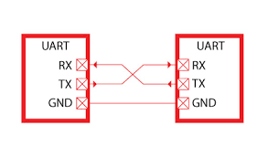
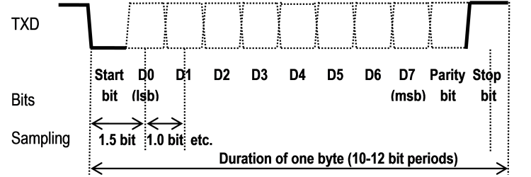

# Последовательный интерфейс

Вернемся к обсуждению взаимодействия компьютера (процессора) и внешних устройств.
С точки зрения организации взаимодействия на физическом уровне, то есть на уровне электрических проводов
или радиосигналов или другой передающей среды, сигнал может передаваться либо последовательно, либо параллельно.
При параллельной передаче данных от отправителя к получателю одновременно передаются несколько бит данных.
Для этого потребуется несколько паралельных электрических проводов, соединяющих отправителя и получателя информации.
При последовательной передаче данных биты сообщения передаются один за одним через передающую среду.

Параллельная передача данных используется для высокоскоростной передачи на небольшие расстояния, как правило, не выходящие за пределы
материнской платы компьютера. Ранее использовались параллельные интерфейсы для связи компьютера и переферийных устройств, такие как SCSI, IDE, ParPort,
но в настоящее время они все оказались вытесненными высокоскоростными последовательными интерфейсами, такими как SATA, USB и прочими.
Присущие параллельным интерфейсам недостатки, такие как сложность разводки проводников на печатной плате или большое количество проводников в кабеле,
взаимовлияние параллельно идущих проводников, рассинхронизация параллельно идущих проводников ограничивают максимальную длину кабеля и максимальную скорость работы.
Эти недостатки отсутствуют у последовательных интерфейсов.

## UART

Существует много разных последовательных (serial) физических интерфейсов и протоколов взаимодействия, таких как USB, SATA, FireWire и т. п.
Мы остановимся на семействе физических интерфейсов и протоколов, обобщенно называющихся UART (Universal Asynchronous Receiver/Transmitter -
Универсальный асинхронный приемополучатель). Асинхронность в названии термина обозначает, что сигнал синхронизации (тактовый сигнал) не передается
по линии от отправителя и получателя. Отправитель и получатель синхронизуются при отправке каждой порции данных (обычно 8 бит).

Самый простой (симплексный)
UART интерфейс состоит из двух проводов - одного для передачи данных только в одну сторону, и второй для установки уровня логического нуля (GND).
Типичный UART состоит из трех контактов: Rx, на котором принимаются данные, Tx, на котором данные отправляются, и GND для поддержания уровня логического нуля.
Двусторонний UART может работать в полудуплексном или полнодуплексном режиме в зависимости от оконечного оборудования и программного обеспечения.

Таким образом, когда говорят о каналах связи, симплексный режим передачи обозначает, что данные могут передаваться только в одном направлении от отправителя к получателю.
Дуплексный режим обозначает, что обе стороны могут обмениваться данными. При этом полнодуплексный режим означает, что стороны обмена могут одновременно принимать и отправлять
данные, то есть в момент времени, когда с контакта Rx считывается входное логическое значение 0 или 1, на контакте Tx устанавливается выходное логическое значение.
Полудуплексный режим означает, что в каждый момент времени выполняется передача данных не более чем в одну сторону, то есть либо одна сторона передает данные другой стороне, либо наоборот,
но не одновременно.

Чтобы соединить две стороны с помощью дуплексного UART нужно выход Rx одной стороны соединить с выходом Tx другой стороны и наоборот, а выход GND соединить друг с другом.

Понятно, что обе стороны должны быть электрически совместимы друг с другом и иметь один уровень логического нуля (земли), то есть, если попробовать соединить один UART-интерфейс
с уровнем логической единицы 12 вольт с UART интерфейсом с уровнем логической единицы 3.3 вольта, то ничего хорошего не произойдет. Кроме того, проводники, соединяющие стороны, сами имеют
свои электрические характеристики (сопротивление, емкость, индуктивность), и поэтому если мы возьмем слишком длинный проводник и маленькое напряжение логической единицы сигнал может просто не дойти
из-за падения напряжения в проводнике. Физические характеристики обменивающихся сторон и передающей среды описываются на физическом уровне стандарта взаимодействия. Например,
стандарт RS232 задает уровень логической единицы в диапазоне от -15V до -3V, а уровень логического нуля в диапазоне от 3V до 15V и задает максимальную емкость передающего кабеля такой,
что максимальная длина типичного RS232 кабеля равна 15 метрам. Если мы будем соединять два UART устройства на любительских микрокомпьютерах (Arduino, Raspberry Pi), то в данном
случае уровень логического нуля будет соответствовать 0V (то есть общей земле), уровень логической единицы будет равен 5V, а длина соединяющих проводников - не более нескольких дециметров.

Передача данных по UART выполняется следующим образом. Обе стороны некоторым образом договариваются о скорости передачи данных, которая измеряется в битах в секунду (бодах).
Если скорость равна, например, 300 бод, то время передачи одного бита равно Tb = 1/300 c (3333 мкс - микросекунды).
Нормально на линии передачи данных выставлено напряжение логической единицы, которое поддерживается все время, когда у сторон включен UART-интерфейс.
Если передатчик хочет начать передачу данных, он на время передачи одного бита устанавливает на линии уровень логического нуля (стартовый бит). Затем передаются биты данных начиная от младшего,
для передачи каждого бита соответствующий логический уровень устанавливается на время Tb. В конце передачи данных может передаваться бит паритета, после которого на линии передачи
данных на время передачи одного или двух битов выставляется уровень логической единицы (стоповые биты). На этом отправка одной "порции" данных считается завершенной.

Прием данных выполняется следующим образом. Приемник отслеживает уровень сигнала на входе Rx. В момент смены уровня сигнала с логической единицы на логический нуль
начинается отсчет времени приема данных. Приемник пропускает интервал времени 1.5 Tb, затем замеряет уровень сигнала на входе Rx через интервал времени Tb. Когда приемник
считал со входной линии стоповые биты передача считается завершенной, и приемник переходит к отслеживанию момента начала следующей передачи. При приеме данных возникают две технические проблемы.
Во-первых, приемник может "опоздать" с определением момента начала передачи. То есть смена логической единицы на логический нуль будет обнаружена не в момент времени T0,
а в момент времени T0 + dt. Здесь мы будем пока игнорировать переходные процессы в проводнике и конечность скорости распространения сигнала, так как UART не работает на скоростях,
на которых эти эффекты оказывают ощутимое воздействие на передачу данных. Во-вторых, скорость работы приемника может отличаться от скорости работы передатчика, даже если они
согласовали скорость передачи. Например, при согласованной скорости передачи 300 бод передатчик фактически передает данные со скоростью 310 бод, а приемник фактически принимает
данные со скоростью 290 бод. Эти проблемы могут привести к ошибкам при передаче данных. Чтобы исключить это, приемник должен проверять состояние входной линии достаточно часто,
как минимум со скоростью в два раза больше, чем скорость передачи данных. Кроме того, рассогласование отсчетов времени не должно превысить половину времени передачи одного бита
за время передачи данных. Если мы предположим, что данные передаются в формате один стартовый бит, 8 бит данных и один стоповый бит (всего 10 бит), то рассогласование скорости передатчика и приемника
не должно быть больше 5%.

При приеме данных целостность принятых данных может контролироваться с помощью бита паритета (parity bit). Бит паритета передается после битов данных перед стоповыми битами.
Если бит паритета работает в режиме четного паритета (even parity), отправитель устанавливает значение бита паритета как исключающее или всех бит данных, то есть бит паритета равен 1,
если в передаваемых данных было нечетное число единичных бит, и 0 в противном случае. На принимающей стороне вычисляется побитовое исключающее или всех битов данных и бита паритета.
Результат операции должен быть равен 0.
Для нечетного паритета бит паритета устанавливается таким образом, что при приеме результатом вычисления побитового исключающего или всех битов данных и бита паритета будет 1.
Бит паритета не является обязательным в отличие от стартового и стопового бита. Бит паритета позволяет выявлять, но не исправлять только изменение значения в одиночном бите.
Более сложный контроль целостности данных может выполняться на более высоких уровнях передачи данных.

Таким образом, чтобы приемник мог правильно декодировать электрические сигналы, посылаемые передатчиком, приемник и передатчик должны иметь одинаковые настройки параметров передачи данных UART:
* Скорость передачи данных в бодах. Она, вообще говоря, может быть любой, но все реализации предоставляют выбор из предопределенного набора скоростей передачи. Наиболее часто используемые значения:
9600, 38400, 115200 бод.
* Количество пересылаемых бит данных, от 5 до 8.
* Тип паритета: отсутствует (N), то есть бит паритета вообще не передается; четный (E); нечетный (O).
* Число стоп-битов: один или два.

В краткой форме настройки передачи данных записываются в виде `9600 8N1`, то есть скорость - 9600 бод, 8 бит данных, без бита паритета, один стоп-бит.
Эти настройки относятся к канальному уровню протокола взаимодействия сторон.

