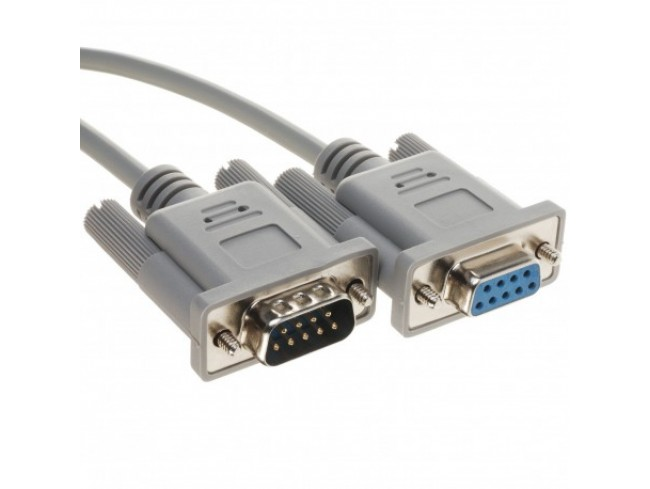
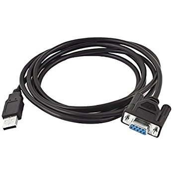
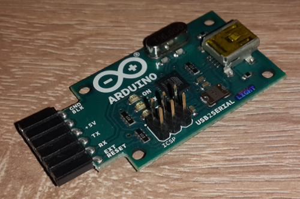
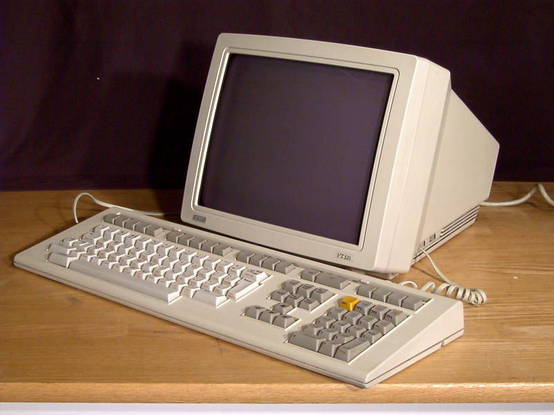

# Последовательный интерфейс

Вернемся к обсуждению взаимодействия компьютера (процессора) и внешних устройств.
С точки зрения организации взаимодействия на физическом уровне, то есть на уровне электрических проводов
или радиосигналов или другой передающей среды, сигнал может передаваться либо последовательно, либо параллельно.
При параллельной передаче данных от отправителя к получателю одновременно передаются несколько бит данных.
Для этого потребуется несколько паралельных электрических проводов, соединяющих отправителя и получателя информации.
При последовательной передаче данных биты сообщения передаются один за одним через передающую среду.

Параллельная передача данных используется для высокоскоростной передачи на небольшие расстояния, как правило, не выходящие за пределы
материнской платы компьютера. Ранее использовались параллельные интерфейсы для связи компьютера и переферийных устройств, такие как SCSI, IDE, ParPort,
но в настоящее время они все оказались вытесненными высокоскоростными последовательными интерфейсами, такими как SATA, USB и прочими.
Присущие параллельным интерфейсам недостатки, такие как сложность разводки проводников на печатной плате или большое количество проводников в кабеле,
взаимовлияние параллельно идущих проводников, рассинхронизация параллельно идущих проводников ограничивают максимальную длину кабеля и максимальную скорость работы.
Эти недостатки отсутствуют у последовательных интерфейсов.

## UART

Существует много разных последовательных (serial) физических интерфейсов и протоколов взаимодействия, таких как USB, SATA, FireWire и т. п.
Мы остановимся на семействе физических интерфейсов и протоколов, обобщенно называющихся UART (Universal Asynchronous Receiver/Transmitter -
Универсальный асинхронный приемополучатель). Асинхронность в названии термина обозначает, что сигнал синхронизации (тактовый сигнал) не передается
по линии от отправителя и получателя. Отправитель и получатель синхронизуются при отправке каждой порции данных (обычно 8 бит).

Самый простой (симплексный)
UART интерфейс состоит из двух проводов - одного для передачи данных только в одну сторону, и второй для установки уровня логического нуля (GND).
Типичный UART состоит из трех контактов: Rx, на котором принимаются данные, Tx, на котором данные отправляются, и GND для поддержания уровня логического нуля.
Двусторонний UART может работать в полудуплексном или полнодуплексном режиме в зависимости от оконечного оборудования и программного обеспечения.

Таким образом, когда говорят о каналах связи, симплексный режим передачи обозначает, что данные могут передаваться только в одном направлении от отправителя к получателю.
Дуплексный режим обозначает, что обе стороны могут обмениваться данными. При этом полнодуплексный режим означает, что стороны обмена могут одновременно принимать и отправлять
данные, то есть в момент времени, когда с контакта Rx считывается входное логическое значение 0 или 1, на контакте Tx устанавливается выходное логическое значение.
Полудуплексный режим означает, что в каждый момент времени выполняется передача данных не более чем в одну сторону, то есть либо одна сторона передает данные другой стороне, либо наоборот,
но не одновременно.

Чтобы соединить две стороны с помощью дуплексного UART нужно выход Rx одной стороны соединить с выходом Tx другой стороны и наоборот, а выход GND соединить друг с другом.


Понятно, что обе стороны должны быть электрически совместимы друг с другом и иметь один уровень логического нуля (земли), то есть, если попробовать соединить один UART-интерфейс
с уровнем логической единицы 12 вольт с UART интерфейсом с уровнем логической единицы 3.3 вольта, то ничего хорошего не произойдет. Кроме того, проводники, соединяющие стороны, сами имеют
свои электрические характеристики (сопротивление, емкость, индуктивность), и поэтому если мы возьмем слишком длинный проводник и маленькое напряжение логической единицы сигнал может просто не дойти
из-за падения напряжения в проводнике. Физические характеристики обменивающихся сторон и передающей среды описываются на физическом уровне стандарта взаимодействия. Например,
стандарт RS232 задает уровень логической единицы в диапазоне от -15V до -3V, а уровень логического нуля в диапазоне от 3V до 15V и задает максимальную емкость передающего кабеля такой,
что максимальная длина типичного RS232 кабеля равна 15 метрам. Если мы будем соединять два UART устройства на любительских микрокомпьютерах (Arduino, Raspberry Pi), то в данном
случае уровень логического нуля будет соответствовать 0V (то есть общей земле), уровень логической единицы будет равен 5V, а длина соединяющих проводников - не более нескольких дециметров.

Передача данных по UART выполняется следующим образом. Обе стороны некоторым образом договариваются о скорости передачи данных, которая измеряется в битах в секунду (бодах).
Если скорость равна, например, 300 бод, то время передачи одного бита равно Tb = 1/300 c (3333 мкс - микросекунды).
Нормально на линии передачи данных выставлено напряжение логической единицы, которое поддерживается все время, когда у сторон включен UART-интерфейс.
Если передатчик хочет начать передачу данных, он на время передачи одного бита устанавливает на линии уровень логического нуля (стартовый бит). Затем передаются биты данных начиная от младшего,
для передачи каждого бита соответствующий логический уровень устанавливается на время Tb. В конце передачи данных может передаваться бит паритета, после которого на линии передачи
данных на время передачи одного или двух битов выставляется уровень логической единицы (стоповые биты). На этом отправка одной "порции" данных считается завершенной.


Прием данных выполняется следующим образом. Приемник отслеживает уровень сигнала на входе Rx. В момент смены уровня сигнала с логической единицы на логический нуль
начинается отсчет времени приема данных. Приемник пропускает интервал времени 1.5 Tb, затем замеряет уровень сигнала на входе Rx через интервал времени Tb. Когда приемник
считал со входной линии стоповые биты передача считается завершенной, и приемник переходит к отслеживанию момента начала следующей передачи. При приеме данных возникают две технические проблемы.
Во-первых, приемник может "опоздать" с определением момента начала передачи. То есть смена логической единицы на логический нуль будет обнаружена не в момент времени T0,
а в момент времени T0 + dt. Здесь мы будем пока игнорировать переходные процессы в проводнике и конечность скорости распространения сигнала, так как UART не работает на скоростях,
на которых эти эффекты оказывают ощутимое воздействие на передачу данных. Во-вторых, скорость работы приемника может отличаться от скорости работы передатчика, даже если они
согласовали скорость передачи. Например, при согласованной скорости передачи 300 бод передатчик фактически передает данные со скоростью 310 бод, а приемник фактически принимает
данные со скоростью 290 бод. Эти проблемы могут привести к ошибкам при передаче данных. Чтобы исключить это, приемник должен проверять состояние входной линии достаточно часто,
как минимум со скоростью в два раза больше, чем скорость передачи данных. Кроме того, рассогласование отсчетов времени не должно превысить половину времени передачи одного бита
за время передачи данных. Если мы предположим, что данные передаются в формате один стартовый бит, 8 бит данных и один стоповый бит (всего 10 бит), то рассогласование скорости передатчика и приемника
не должно быть больше 5%.

При приеме данных целостность принятых данных может контролироваться с помощью бита паритета (parity bit). Бит паритета передается после битов данных перед стоповыми битами.
Если бит паритета работает в режиме четного паритета (even parity), отправитель устанавливает значение бита паритета как исключающее или всех бит данных, то есть бит паритета равен 1,
если в передаваемых данных было нечетное число единичных бит, и 0 в противном случае. На принимающей стороне вычисляется побитовое исключающее или всех битов данных и бита паритета.
Результат операции должен быть равен 0.
Для нечетного паритета бит паритета устанавливается таким образом, что при приеме результатом вычисления побитового исключающего или всех битов данных и бита паритета будет 1.
Бит паритета не является обязательным в отличие от стартового и стопового бита. Бит паритета позволяет выявлять, но не исправлять только изменение значения в одиночном бите.
Более сложный контроль целостности данных может выполняться на более высоких уровнях передачи данных.

Таким образом, чтобы приемник мог правильно декодировать электрические сигналы, посылаемые передатчиком, приемник и передатчик должны иметь одинаковые настройки параметров передачи данных UART:
* Скорость передачи данных в бодах. Она, вообще говоря, может быть любой, но все реализации предоставляют выбор из предопределенного набора скоростей передачи. Наиболее часто используемые значения:
9600, 38400, 115200 бод.
* Количество пересылаемых бит данных, от 5 до 8.
* Тип паритета: отсутствует (N), то есть бит паритета вообще не передается; четный (E); нечетный (O).
* Число стоп-битов: один или два.

В краткой форме настройки передачи данных записываются в виде `9600 8N1`, то есть скорость - 9600 бод, 8 бит данных, без бита паритета, один стоп-бит.
Эти настройки относятся к канальному уровню протокола взаимодействия сторон.

## Использование UART

Принцип последовательной передачи данных UART широко используется для подключения внешнего оборудования. Например, для модемов, GPS-приемников, сканеров штрих-кодов, то есть,
когда не требуется высокая скорость приема и передачи данных.

Иногда физическое подключение к UART выполняется с помощью трех контактов с одной и другой стороны, соединенных проводами. Такое подключение может использоваться как
интерфейс для отладки или служебного доступа к аппаратуре. На фотографии ниже показано соединение по UART двух микрокомпьютеров: Orange Pi и Rasperry Pi.
Микрокомпьютер Raspberry Pi выступает в роли терминала, то есть будет отображать полученную по последовательному порту информацию на свою консоль, а введенные пользователем
данные будут отправляться на последовательный порт. Таким образом можно подключиться к работающему микрокомпьютеру даже в случае, если у него не активированы сетевые адаптеры,
недоступна клавиатура и экран.

UART реализован в интерфейсе стандарта RS-232. Стандарт был опубликован в 1960 году и используется в промышленной автоматике до сих пор. Стандарт определяет физическую среду
передачи данных, то есть уровни напряжений, допустимые физические характеристики передающей среды. Кроме того стандарт определяет разные типы разъемов для подключения кабеля
к устройству. Например, на фотографии ниже показан 9-пиновый разъем DE-9.



Разъемы DE-9 присутствовали на всех компьютерах вплоть до конца 90-х годов. К ним подключались модемы, сканеры, мыши. В настоящее время в качестве разъема для подключения
периферийных устройств используется USB. Большинство периферийных устройств, подключаемых к бытовым компьютерам, также теперь используют интерфейс USB. Однако чтобы
подключить устройство по стандарту RS-232 можно использовать конверторы RS-232 в USB, например, показанные на фотографии ниже.



Для подключения к отладочному UART-интерфейсу обычно используется конвертер USB в UART, например, показанный на фотографии ниже.



В любом случае при подключении такого конвертера в разъем USB на компьютере создается виртуальный последовательный порт, то есть внешнее устройство, которое
с точки зрения интерфейса использования ведет себя как последовательный порт, но обмен данными с этим виртуальным устройством преобразовывается ядром
в обмен данными с USB-конвертером, который на своей стороне преобразует обмен данными по USB в обмен данными по RS-232 или UART. То есть USB-интерфейс будет
невидимым с точки зрения интерфейса использования мостом между компьютером и последовательным портом.

## Терминалы

Одним из основных устройств, которые подключались к компьютерам в 70- и 80-е годы были терминалы. Терминал представлял собой клавиатуру и экран, который обычно
поддерживал отображение текста в окне с 25 строками и 80 столбцами. Существовали также и терминалы, которые поддерживали отображение графики. Терминал подключался
к компьютеру по интерфейсу RS-232, и к одному компьютеру могли подключаться десятки таких терминалов. Пользователи, работающие за терминалами, подключенными
к одному компьютеру, разделяли ресурсы одного компьютера. Фотография терминала VT-320 приведена ниже.



Терминалы фирмы DEC (Digital Equipment Corporation) семейства VT были самыми популярными. Модель DEC VT-220 была продана более чем в одном миллионе экземпляров,
что сравнимо с числом персональных компьютеров, проданных в те же годы. Терминалы DEC очень сильно повлияли на развитие Unix-систем. Одним из самых
распространенных микрокомпьютеров в 80-е годы был микрокомпьютер DEC VAX, к которому, естественно, подключались терминалы семейства DEC VT. Помимо "штатной"
операционной системы VAX VMS на микрокомпьютерах VAX была распространена BSD Unix, особенно в университетах. Поэтому большая часть разработки операционной системы BSD Unix
выполнялась на VAX.

Одной из основных программ на современных персональных компьютерах, работающих под управлением Linux в графическом интерфейсе, является программа-эмулятор терминала.
Программа отображает на экране текстовое окно по умолчанию стандартного размера 25 строк на 80 столбцов. Эмулятор терминала отправляет ввод с клавиатуры программе, работающей
на данном терминале, а вывод программы отображает в окно на экране. Все эмуляторы терминалов, начиная от xterm и его производных (konsole, gnome-terminal, xfce4-terminal и т. д.),
эмулируют работу алфавитно-цифрового терминала, основанного именно на DEC VT-220. Терминалы, подключаемые по последовательному интерфейсу, до сих пор поддерживаются в Linux. Если подключить
к работающей системе терминал из 80-х годов, Linux прекрасно будет с ним работать. Более того, Linux поддерживает консоль (то есть "самый главный" терминал) на последовательном порту,
что полезно, если к компьютеру не подключены ни клавиатура, ни монитор.

Терминал передает информацию о нажатой клавише компьютеру, к которому он подключен. Для алфавитно-цифровых и управляющих клавиш передается соответствующий код ASCII.
Например, нажатая на клавиатуре цифра 0 передается в компьютер как 48 (ASCII-код символа '0'), комбинация клавиш Ctrl-C передается в компьютер как 3, и так далее.
Для специальных клавиш, таких как клавиши управления курсором, Fn, INS, DEL и т. п. в компьютер передаются так называемые ESC-последовательности, кодирующие эту клавишу.
ESC-последовательность - это последовательность байт, которая начинается с кода 27 (восьмеричное 33), соответствующего в кодировке ASCII управляющему символу ESC.
Так, при нажатии на клавишу "стрелка вверх" в компьютер будет передана последовательность трех байт `ESC '[' A`.

Терминал отображает данные, получаемые от компьютера, при этом терминал специальным образом обрабатывает ESC-последовательности, с помощью которых можно управлять отображением
символов на экране или режимом работы терминала. Например, если передать на терминал последовательность четырех байт `ESC '[' '2' 'J'`, экран будет очищен.

Как было отмечено выше, современные эмуляторы терминалов работают точно также, то есть при нажатии специальных клавиш в программу передается ESC-последовательность,
кодирующая эту клавишу, и при выводе эмуляторы терминалов специальным образом обрабатывают ESC-последовательности.

Существовало и существует большое количество как аппаратных терминалов, так и программных эмуляторов. Они могут отличаться друг от друга своей системой команд
и другими характеристиками. Чтобы сделать программы, работающие с терминалами, максимально гибкими, свойства терминалов описываются в специальной базе,
называемой terminfo. В современных операционных системах она размещается, как правило, в каталог /usr/share/terminfo. Каждому типу терминала соответствует отдельный файл.
Например, описание терминала `vt220` находится в файле `/usr/share/terminfo/v/vt220`. Получить описание терминала в текстовом виде можно c помощью команды `infocmp`,
например,
```
[cher@localhost ~]$ infocmp vt220
vt220|vt200|dec vt220,
	am, mc5i, mir, msgr, xenl, xon,
	cols#80, it#8, lines#24, vt#3,
	acsc=``aaffggjjkkllmmnnooppqqrrssttuuvvwwxxyyzz{{||}}~~,
	bel=^G, blink=\E[5m, bold=\E[1m, clear=\E[H\E[J, cr=^M,
	csr=\E[%i%p1%d;%p2%dr, cub=\E[%p1%dD, cub1=^H,
	cud=\E[%p1%dB, cud1=^J, cuf=\E[%p1%dC, cuf1=\E[C,
	cup=\E[%i%p1%d;%p2%dH, cuu=\E[%p1%dA, cuu1=\E[A,
	dch=\E[%p1%dP, dch1=\E[P, dl=\E[%p1%dM, dl1=\E[M,
	ech=\E[%p1%dX, ed=\E[J, el=\E[K, el1=\E[1K, enacs=\E)0,
	flash=\E[?5h$<200/>\E[?5l, home=\E[H, ht=^I, hts=\EH,
	ich=\E[%p1%d@, if=/usr/share/tabset/vt100,
	il=\E[%p1%dL, il1=\E[L, ind=\ED,
	is2=\E[?7h\E[>\E[?1l\E F\E[?4l, kbs=^H, kcub1=\E[D,
	kcud1=\E[B, kcuf1=\E[C, kcuu1=\E[A, kdch1=\E[3~, kf1=\EOP,
	kf10=\E[21~, kf11=\E[23~, kf12=\E[24~, kf13=\E[25~,
	kf14=\E[26~, kf17=\E[31~, kf18=\E[32~, kf19=\E[33~,
	kf2=\EOQ, kf20=\E[34~, kf3=\EOR, kf4=\EOS, kf6=\E[17~,
	kf7=\E[18~, kf8=\E[19~, kf9=\E[20~, kfnd=\E[1~,
	khlp=\E[28~, kich1=\E[2~, knp=\E[6~, kpp=\E[5~,
	krdo=\E[29~, kslt=\E[4~, lf1=pf1, lf2=pf2, lf3=pf3, lf4=pf4,
	mc0=\E[i, mc4=\E[4i, mc5=\E[5i, nel=\EE, rc=\E8, rev=\E[7m,
	ri=\EM, rmacs=\E(B$<4>, rmam=\E[?7l, rmir=\E[4l,
	rmso=\E[27m, rmul=\E[24m, rs1=\E[?3l, sc=\E7,
	sgr=\E[0%?%p6%t;1%;%?%p2%t;4%;%?%p4%t;5%;%?%p1%p3%|%t;7%;m%?%p9%t\E(0%e\E(B%;$<2>,
	sgr0=\E[m\E(B, smacs=\E(0$<2>, smam=\E[?7h, smir=\E[4h,
	smso=\E[7m, smul=\E[4m, tbc=\E[3g, u6=\E[%i%d;%dR,
	u7=\E[6n, u8=\E[?%[;0123456789]c, u9=\E[c,
```

Идентификатор типа терминала, используемого в данной сессии пользователя, задается с помощью переменной окружения `TERM`:
```
[cher@localhost ~]$ echo $TERM
xterm-256color
```

Именно эта переменная используется программами, работающими с экраном и клавиатурой специальным образом (например,
редакторы vim, emacs, nano отображают текст для редактирования на экране и поддерживают навигацию по тексту с помощью
клавиш управления курсором и т. д.). Значение переменной `TERM` используется для получения свойств терминала
из базы terminfo и настройки на особенности терминала. Если изменить переменную окружения `TERM` неправильно,
эти программы могут отображать данные неправильно или вообще перестанут работать.

## Канонический режим терминала в Unix

Когда терминал подключен к последовательному порту драйвер последовательного порта в ядре Unix предоставляет
дополнительную функциональность по предобработке потока данных, поступающего с терминала.
Предобработка выполняется в каноническом режиме работы последовательного порта, который по умолчанию включен.

В каноническом режиме ядро выполняет построчную буферизацию вводимых данных. Данные пересылаются в процесс,
ожидающий на read, при получении от терминала специальных кодов, обозначаемых NL (\n) или EOF (Ctrl-D).
Если во входном буфере накопилось несколько строк текста, разделенных NL, ядро будет пересылать текст процессу
построчно, но не больше, чем размер буфера read.

Пока введенная строка находится в буфере ядре, получение символа, обозначаемого ERASE (обычно это BackSpace или Ctrl-H),
приводит к удалению последнего символа, если строка еще не пуста. Получения символа KILL (обычно это Ctrl-U)
приводит к очистке всей введенной строки.

Получение символа, обозначаемого EOF (обычно Ctrl-D), приводит к передаче в процесс сначала накопленной во входном буфере
части строки, а потом к возврату результата 0 из системного вызова read. Таким образом с помощью нажатия Ctrl-D
процесс принуждается к получению признака конца файла при чтении с терминала.

Кроме того, драйвер последовательного порта обрабатывает специальным образом символы INTR (Ctrl-C), SUSP (Ctrl-Z), QUIT (Ctrl-\),
которые приводят к отправке сигналов SIGINT, SIGTSTP, SIGQUIT группе процессов, заявленной как основная группа процессов данного
терминала (см. далее). Специальные символы, обрабатываемые в драйвере ядра (Ctrl-D, Ctrl-C и прочие), не передаются в процесс.

В неканоническом режиме терминала предобработка получаемых символов отключается. Полученные символы становятся доступы
считывающему процессу немедленно, без буферизации до символа конца строки. Специальная обработка символов Ctrl-C, Ctrl-Z, Ctrl-\
также отключается.

Неканонический режим терминала используется, например, интерпретатором командной строки bash в режиме редактирования строки ввода.
Но как только пользователь закончил редактирование и нажал клавишу перевода строки, bash возвращает терминал в канонический режим
и запускает выполнение команды, таким образом команды, запущенные из интерактивной оболочки, все равно получают
в начале работы терминал в каноническом режиме работы.

Когда терминал отключается от компьютера, что в случае физических терминалов, подключаемых по RS-232,
распознается по установке состояния линии в логический 0 на достаточно большой промежуток времени, например, 0.5 с,
драйвер терминала выполняет действия, называемые HANGUP. В разных версиях Unix они немного отличаются.
В Linux при отключении терминала ядро посылает группе процесса-лидера сессии сигналы SIGCONT и SIGHUP,
а основной группе процессов терминала сигнал SIGHUP. Все процессы, у которых данный терминал был управляющим,
отключаются от управляющего терминала.

Управляющие терминалы, сессии и группы процессов в Unix (так называемый Job Control) будут расмотрены отдельно.

## Управление последовательным интерфейсом и терминалом в Unix

Как было сказано выше, драйвер последовательного интерфейса в Unix одновременно является и драйвером терминала,
поэтому в дальнейшем будет использоваться термин "управление терминалом".
Логически управление терминалом состоит из нескольких уровней:
* физический уровень, на котором задаются настройки физического уровня передачи;
* предобработка полученных с терминала данных;
* постобработка выводимых на терминал данных;
* локальная обработка.

Функции управления терминалом и структуры данных описаны в заголовочном файле `<termios.h>`. Эти функции являются
обертками к низкоуровневому системному вызову `ioctl`, но конкретные параметры системного вызова `ioctl` являются
системно-зависимыми, а библиотечные функции в `<termios.h>` стандартизованы POSIX.

В качестве первого аргумента функции требуют файловый дескриптор устройства-терминала. Это может быть файловый
дескриптор стандартного потока ввода или вывода, если программа запущена из интерактивной оболочки типа /bin/bash,
и именно так работают с терминалом полноэкранные программы, например, vim или mc.
Либо устройство-терминал можно открыть с помощью системного вызова `open` следующим образом:

```
    int fd = open(path, O_RDWR | O_NOCTTY);
```

Где `path` - это путь к файлу-устройству, например, `/dev/ttyUSB0`. Во флаги добавлен флаг `O_NOCTTY`,
который запрещает установку открытого устройства-терминала в качестве управляющего терминала текущего процесса.
Об управляющих терминалах будет рассказано отдельно.
Полученный файловый дескриптор `fd` - дуплексный. При записи в него данные передаются на терминал,
а при чтении из него в процесс копируются данные, полученные с терминала.

Если программа хочет работать с файловыми дескрипторами стандартного потока ввода или стандартного потока вывода
как с терминалом, предварительно имеет смысл проверить, является ли связанный с файловым дескриптором объект терминалом.

```
    if (!isatty(STDIN_FILENO)) {
        fprintf(stderr, "not a terminal\n");
        exit(1);
    }
```

Функция `isatty` определена в `<unistd.h>`. В этом фрагменте программы мы проверяем стандартный поток ввода, то есть
файловый дескриптор 0.

Для хранения настроек терминала используется структура `struct termios`, а текущие настройки терминала можно получить
с помощью `tcgetattr`:

```
    struct termios ti;
    tcgetattr(term_fd, &ti);
```

Файловый дескриптор `term_fd` должен быть связан с терминалом. В структуру `ti` записываются настройки терминала.
Настройки терминала, полученные в начале работы программы, имеет смысл сохранить, чтобы в конце работы программы
восстановить режим работы терминала, который был при старте программы. В противном случае возможны разные странные
эффекты при дальнейшей работе в интерактивной оболочке. Если программа завершилась, оставив терминал в "непонятном"
состоянии, полностью сбросить его в исходное состояние можно с помощью команды `reset`, которую нужно запустить
из командной строки.

Чтобы установить новое или восстановить исходное состояние терминала используется функция `tcsetattr`.

```
    tcsetattr(term_fd, TCSAFLUSH, &ti);
```

Опция `TCSAFLUSH` означает что перед установкой нового состояния все данные, еще не переданные на терминал,
будут переданы, а данные, которые уже были получены с терминала, будут проигнорированы.

Желаемые настройки терминала задаются в структуре `struct termios` непосредственно, либо с помощью
вспомогательных функций. Скорость обмена устанавливается отдельно для записи на терминал и чтения с терминала.

```
    cfsetospeed(&ti, B38400);  // скорость вывода - 38400
    cfsetispeed(&ti, B38400);  // скорость ввода - 38400
```

Большое количество настроек задаются в отдельных битах в полях `c_iflag`, `c_oflag`, `c_cflag`, `c_lflag`.
Поле `c_cflag` содержит настройки физического уровня, `c_iflag` содержит настройки предобработки считанных данных,
`c_oflag` содержит настройки постобработки записываемых данных, `c_lflag` содержит настройки локальной обработки.

Чтобы подготовить `struct termios` для переключения терминала в неканонический ("raw") режим
можно использовать функцию `cfmakeraw`, которая поддерживается только на Linux.
На других системах необходимо самостоятельно установить все значения полей. Эта функция не меняет настройки
физического уровня, которые все равно нужно установить самостоятельно.

```
    cfmakeraw(&ti);
```

### Настройки физического уровня

Далее перечислены настройки физического уровня. Они задаются в поле `c_cflag` структуры `struct termios`.

```
    // задаем количество передаваемых бит данных
    ti.c_cflag &= ~CSIZE;    // сбрасываем старые настройки
    ti.c_cflag |= CS8;       // 8 бит передаваемых данных; альтернативы: CS5, CS6, CS7 для 5, 6, 7 бит данных

    // устаналиваем один стоповый бит (обычная настройка)
    ti.c_cflag &= ~CSTOPB;

    // устанавливаем два стоповых бита (редко когда)
    ti.c_cflag |= CSTOPB;

    // устанавливаем отсутствие бита паритета
    ti.c_cflag &= ~(PARENB | PARODD);

    // устанавливаем четный паритет
    ti.c_cflag &= ~PARODD;
    ti.c_cflag |= PARENB;

    // устанавливаем нечетный паритет
    ti.c_cflag |= PARENB | PARODD;

    // аппаратный контроль потока реализуется с помощью дополнительных контактов RTS/CTS
    // в интерфейсе RS-232. В простых UART он отсутствует.
    // запрещаем аппаратный контроль потока (hardware flow control)
    ti.c_cflag &= ~CRTSCTS;

    // включаем аппаратный контроль потока
    ti.c_cflag |= CRTSCTS;
```


